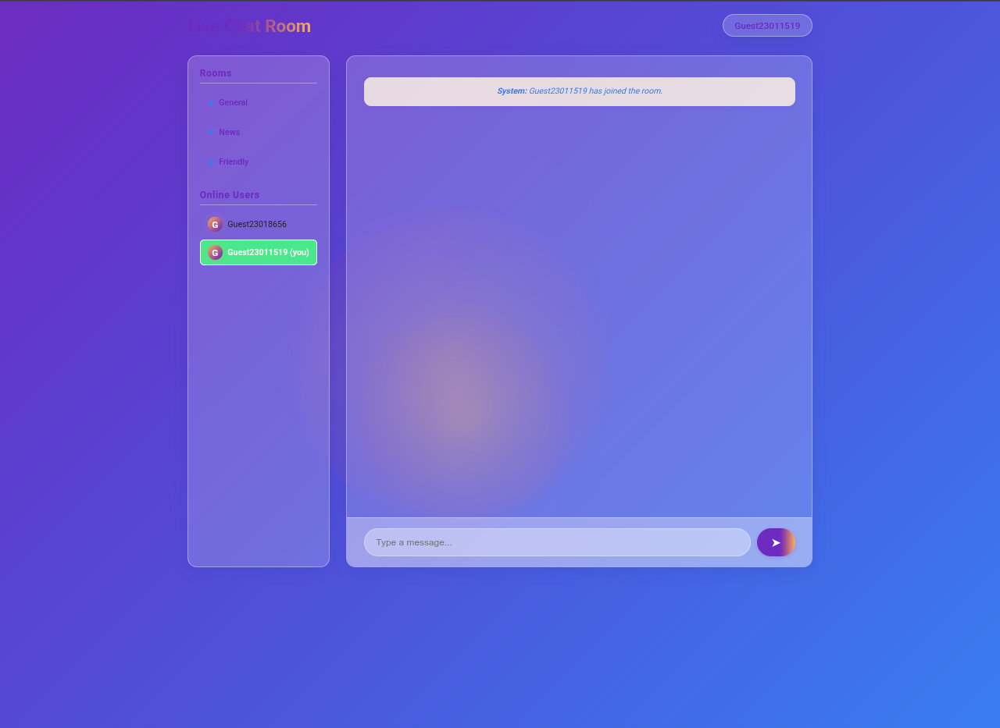

# Live Chat Room

A beautiful, modern, and fully responsive real-time chat application built with **Flask**, **Flask-SocketIO**, and **Vanilla JS**.  
Features a glassmorphism UI, animated interactions, mobile-first design, and unique username support.

---

## ✨ Features

- **Real-time chat** in multiple rooms
- **Online users list** (with avatars)
- **Change your username** (unique, no conflicts)
- **Private messaging**
- **Animated, glassy UI** with floating emojis
- **Mobile-first, app-like experience**
- **No registration required** (guest mode)
- **Fun, responsive design** with smooth transitions

---

## 📸 Screenshots




---

## 🚀 Getting Started

### 1. Clone the repository

```bash
git clone https://github.com/hiddent3erminal/Live-Chat-Room.git
cd Live-Chat-Room
```

### 2. Install dependencies

```bash
python3 -m venv venv
source venv/bin/activate
pip install -r requirements.txt
```

### 3. Set environment variables

Create a `.env` file or set these in your shell:

```bash
export SECRET_KEY='your-very-secret-key'
export FLASK_DEBUG=1  # Set to 0 in production!
export CORS_ORIGINS='http://localhost:5000'
```

### 4. Run the app

```bash
python main.py
```

Visit [http://localhost:5000](http://localhost:5000) in your browser.

---

## 🏗️ Project Structure

```
Live-Chat-Room/
├── main.py
├── requirements.txt
├── static/
│   ├── styles.css
│   └── chat.js
├── templates/
│   └── index.html
└── README.md
├── screenshot.png
```

---

## 🛡️ Security & Production Notes

- **Set a strong `SECRET_KEY`** in production.
- **Set `DEBUG=0`** in production.
- **Set `CORS_ORIGINS`** to your domain in production.
- **For scaling:** Use Redis for session/user storage and run with Gunicorn + eventlet/gevent.
- **No passwords or sensitive data** are stored or transmitted.

---

## 📝 Customization

- **Rooms:** Edit `CHAT_ROOMS` in `main.py`.
- **Theme:** Tweak colors in `static/styles.css`.
- **Logo:** Add your own logo in the header of `index.html`.
- **Background:** SVG background can be customized or removed.

---

## 📱 Mobile Experience

- Sidebar collapses on small screens.
- "Show Online Users" button toggles the sidebar on mobile.
- Sticky input bar for easy chatting.

---

## 🪪 License

MIT License. See [LICENSE](LICENSE) for details.

---

## 🤝 Contributing

Pull requests and issues are welcome!  
Please open an issue for bugs or feature requests.

---

## 🙏 Credits

- [Flask](https://flask.palletsprojects.com/)
- [Flask-SocketIO](https://flask-socketio.readthedocs.io/)
- [Socket.IO](https://socket.io/)
- [Google Fonts](https://fonts.google.com/)
- Emoji art from Unicode

---

## ⭐️ Show your support

If you like this project, please ⭐️ star the repo and share it!

---
